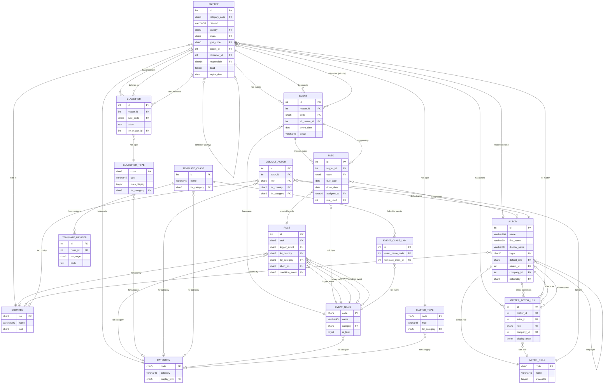
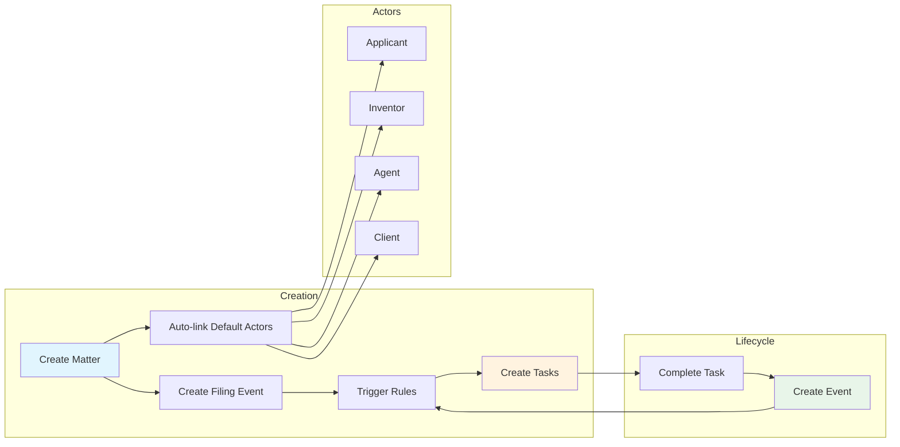
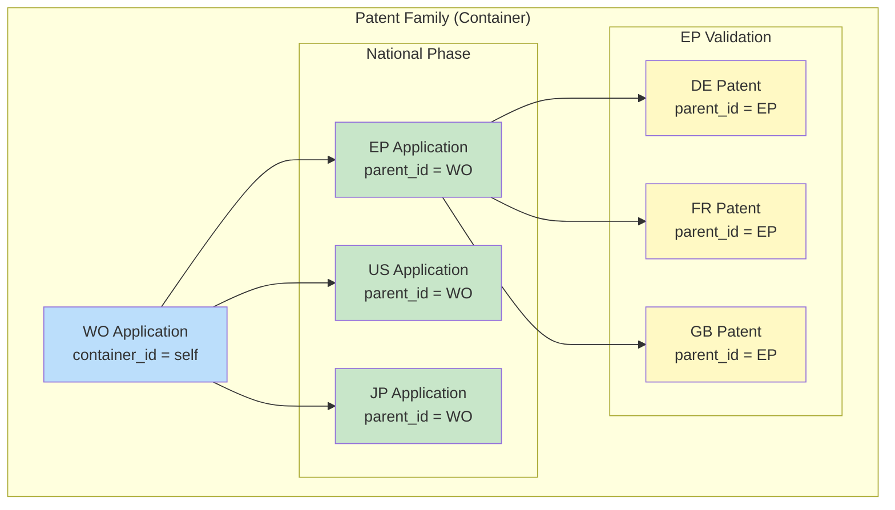
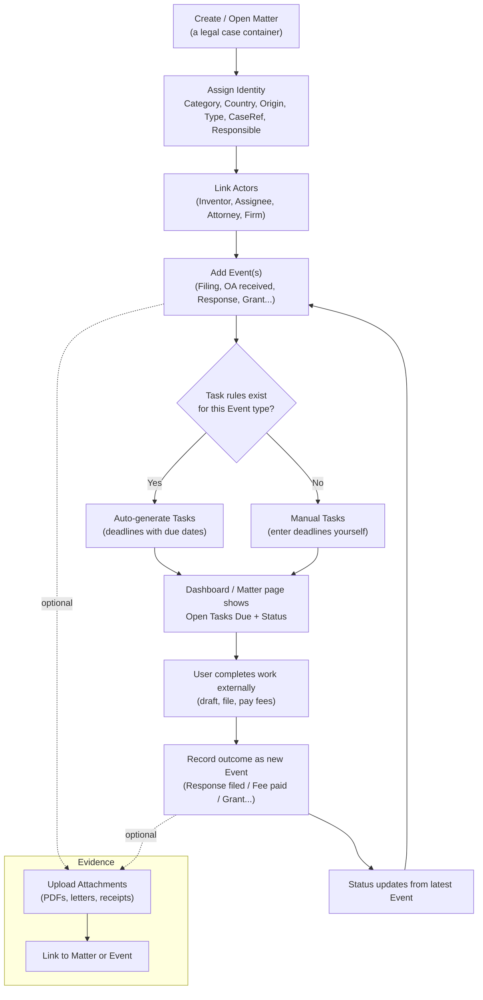
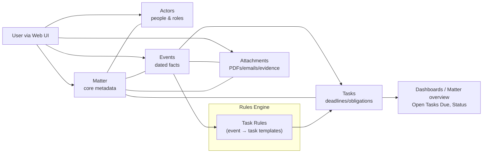
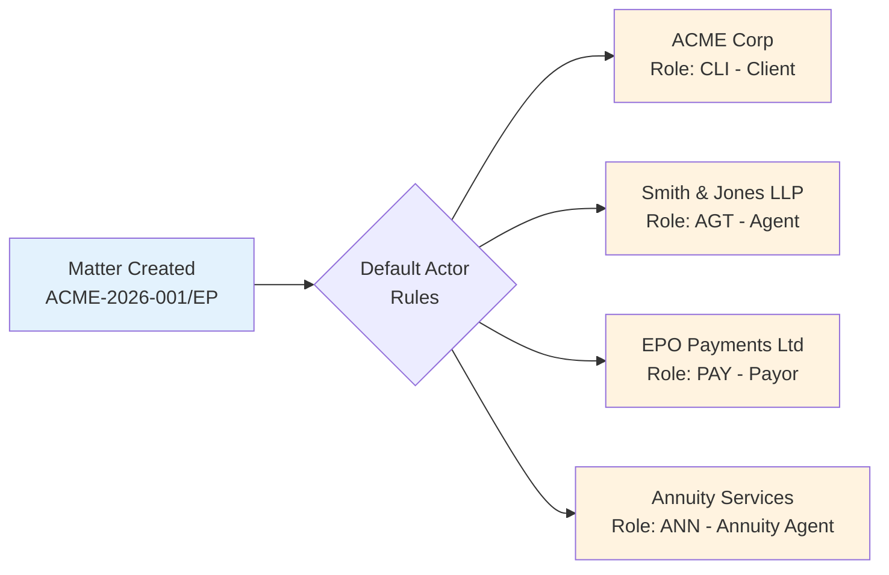
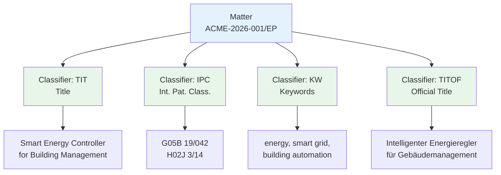
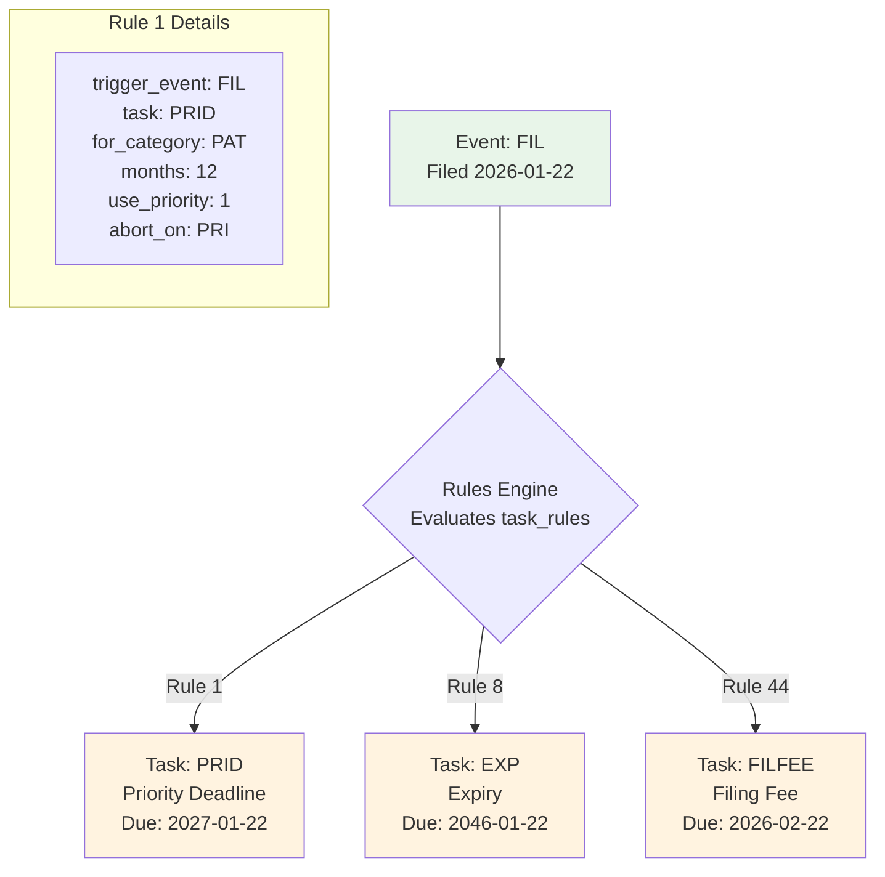
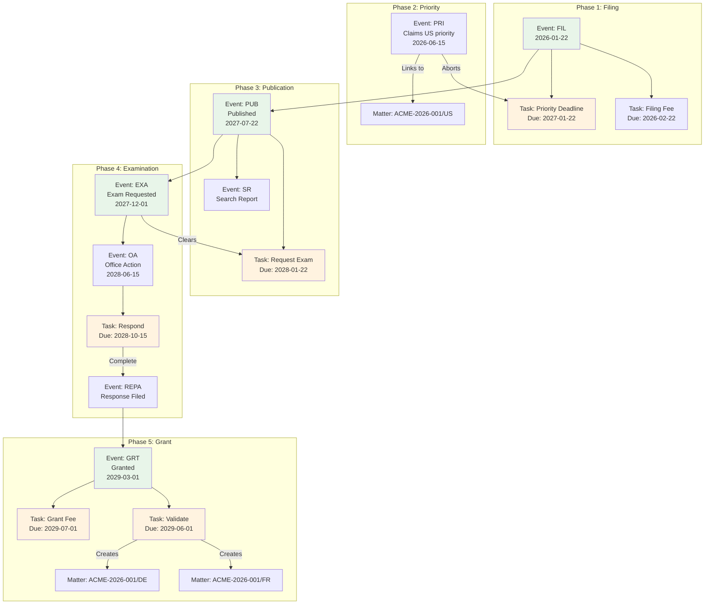
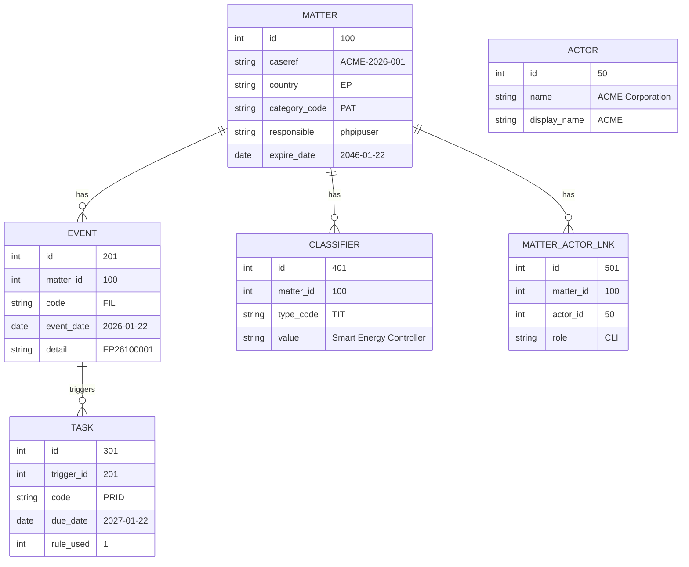

# phpIP Project Architecture

## Overview

**phpIP** is a Laravel-based Intellectual Property (IP) Management System designed to track patents, trademarks, designs, and other IP matters through their lifecycle from filing to grant/registration and maintenance.

---

## System Architecture Diagram

```
┌─────────────────────────────────────────────────────────────────────────────────────────┐
│                                    PRESENTATION LAYER                                    │
├─────────────────────────────────────────────────────────────────────────────────────────┤
│  ┌─────────────┐  ┌─────────────┐  ┌─────────────┐  ┌─────────────┐  ┌─────────────┐   │
│  │   Blade     │  │    Vite     │  │    SASS     │  │ JavaScript  │  │   Alpine.js │   │
│  │  Templates  │  │   Bundler   │  │   Styles    │  │   (ES6+)    │  │  Framework  │   │
│  └─────────────┘  └─────────────┘  └─────────────┘  └─────────────┘  └─────────────┘   │
│                                resources/views/                                          │
└─────────────────────────────────────────────────────────────────────────────────────────┘
                                          │
                                          ▼
┌─────────────────────────────────────────────────────────────────────────────────────────┐
│                                   APPLICATION LAYER                                      │
├─────────────────────────────────────────────────────────────────────────────────────────┤
│  ┌─────────────────────────────────────────────────────────────────────────────────┐    │
│  │                              ROUTING (routes/web.php)                            │    │
│  └─────────────────────────────────────────────────────────────────────────────────┘    │
│                                          │                                              │
│  ┌─────────────────────────────────────────────────────────────────────────────────┐    │
│  │                                  MIDDLEWARE                                       │    │
│  │   ┌──────────────┐  ┌──────────────┐  ┌──────────────┐  ┌──────────────┐        │    │
│  │   │     Auth     │  │   Throttle   │  │   Verified   │  │    Guest     │        │    │
│  │   └──────────────┘  └──────────────┘  └──────────────┘  └──────────────┘        │    │
│  └─────────────────────────────────────────────────────────────────────────────────┘    │
│                                          │                                              │
│  ┌─────────────────────────────────────────────────────────────────────────────────┐    │
│  │                                 CONTROLLERS                                       │    │
│  │  ┌─────────────────┐  ┌─────────────────┐  ┌─────────────────┐                  │    │
│  │  │ MatterController│  │  TaskController │  │  EventController│  ...             │    │
│  │  └─────────────────┘  └─────────────────┘  └─────────────────┘                  │    │
│  └─────────────────────────────────────────────────────────────────────────────────┘    │
│                                          │                                              │
│  ┌─────────────────────────────────────────────────────────────────────────────────┐    │
│  │                                   SERVICES                                        │    │
│  │  ┌────────────────────┐  ┌────────────────────┐  ┌────────────────────┐         │    │
│  │  │DocumentMergeService│  │MatterExportService │  │    OPSService      │         │    │
│  │  └────────────────────┘  └────────────────────┘  └────────────────────┘         │    │
│  │  ┌────────────────────┐                                                          │    │
│  │  │ SharePointService  │                                                          │    │
│  │  └────────────────────┘                                                          │    │
│  └─────────────────────────────────────────────────────────────────────────────────┘    │
│                                          │                                              │
│  ┌─────────────────────────────────────────────────────────────────────────────────┐    │
│  │                                   POLICIES                                        │    │
│  │                           MatterPolicy (Authorization)                            │    │
│  └─────────────────────────────────────────────────────────────────────────────────┘    │
└─────────────────────────────────────────────────────────────────────────────────────────┘
                                          │
                                          ▼
┌─────────────────────────────────────────────────────────────────────────────────────────┐
│                                     DOMAIN LAYER                                         │
├─────────────────────────────────────────────────────────────────────────────────────────┤
│  ┌─────────────────────────────────────────────────────────────────────────────────┐    │
│  │                                    MODELS                                         │    │
│  │                                                                                   │    │
│  │    ┌──────────────────────────────────────────────────────────────────────┐      │    │
│  │    │                         CORE ENTITIES                                 │      │    │
│  │    │  ┌────────┐  ┌────────┐  ┌────────┐  ┌────────┐  ┌────────┐         │      │    │
│  │    │  │ Matter │  │  Actor │  │  Event │  │  Task  │  │  Rule  │         │      │    │
│  │    │  └────────┘  └────────┘  └────────┘  └────────┘  └────────┘         │      │    │
│  │    └──────────────────────────────────────────────────────────────────────┘      │    │
│  │                                                                                   │    │
│  │    ┌──────────────────────────────────────────────────────────────────────┐      │    │
│  │    │                     REFERENCE/LOOKUP TABLES                           │      │    │
│  │    │  ┌──────────┐  ┌──────────┐  ┌──────────┐  ┌──────────┐              │      │    │
│  │    │  │ Category │  │ Country  │  │   Role   │  │EventName │              │      │    │
│  │    │  └──────────┘  └──────────┘  └──────────┘  └──────────┘              │      │    │
│  │    │  ┌──────────┐  ┌──────────┐  ┌──────────────┐                        │      │    │
│  │    │  │MatterType│  │   Fee    │  │ClassifierType│                        │      │    │
│  │    │  └──────────┘  └──────────┘  └──────────────┘                        │      │    │
│  │    └──────────────────────────────────────────────────────────────────────┘      │    │
│  │                                                                                   │    │
│  │    ┌──────────────────────────────────────────────────────────────────────┐      │    │
│  │    │                        PIVOT/LINK TABLES                              │      │    │
│  │    │  ┌───────────┐  ┌────────────┐  ┌──────────────┐  ┌──────────────┐   │      │    │
│  │    │  │ActorPivot │  │ Classifier │  │DefaultActor  │  │EventClassLnk │   │      │    │
│  │    │  └───────────┘  └────────────┘  └──────────────┘  └──────────────┘   │      │    │
│  │    └──────────────────────────────────────────────────────────────────────┘      │    │
│  │                                                                                   │    │
│  │    ┌──────────────────────────────────────────────────────────────────────┐      │    │
│  │    │                        DOCUMENT TEMPLATES                             │      │    │
│  │    │  ┌──────────────┐  ┌────────────────┐                                │      │    │
│  │    │  │TemplateClass │  │TemplateMember  │                                │      │    │
│  │    │  └──────────────┘  └────────────────┘                                │      │    │
│  │    └──────────────────────────────────────────────────────────────────────┘      │    │
│  │                                                                                   │    │
│  │    ┌──────────────────────────────────────────────────────────────────────┐      │    │
│  │    │                       VIEWS (Read-Only)                               │      │    │
│  │    │  ┌──────────────┐  ┌──────────────────┐  ┌──────────────┐            │      │    │
│  │    │  │ MatterActors │  │MatterClassifiers │  │    Users     │            │      │    │
│  │    │  └──────────────┘  └──────────────────┘  └──────────────┘            │      │    │
│  │    └──────────────────────────────────────────────────────────────────────┘      │    │
│  │                                                                                   │    │
│  │    ┌──────────────────────────────────────────────────────────────────────┐      │    │
│  │    │                         AUDIT/LOGGING                                 │      │    │
│  │    │  ┌──────────────┐                                                    │      │    │
│  │    │  │ RenewalsLog  │                                                    │      │    │
│  │    │  └──────────────┘                                                    │      │    │
│  │    └──────────────────────────────────────────────────────────────────────┘      │    │
│  └─────────────────────────────────────────────────────────────────────────────────┘    │
│                                                                                         │
│  ┌─────────────────────────────────────────────────────────────────────────────────┐    │
│  │                                    TRAITS                                         │    │
│  │  ┌────────────────────┐  ┌────────────────────┐  ┌─────────────────────────┐    │    │
│  │  │ HasActorsFromRole  │  │ HasTableComments   │  │HasTranslationsExtended │    │    │
│  │  └────────────────────┘  └────────────────────┘  └─────────────────────────┘    │    │
│  └─────────────────────────────────────────────────────────────────────────────────┘    │
└─────────────────────────────────────────────────────────────────────────────────────────┘
                                          │
                                          ▼
┌─────────────────────────────────────────────────────────────────────────────────────────┐
│                                   DATABASE LAYER                                         │
├─────────────────────────────────────────────────────────────────────────────────────────┤
│                                                                                         │
│    MySQL / MariaDB Database with Triggers and Stored Procedures                         │
│                                                                                         │
│    ┌─────────────────────────────────────────────────────────────────────────────┐     │
│    │  TRIGGERS: Automatic task creation, deadline calculation, status updates    │     │
│    │  PROCEDURES: insert_recurring_renewals, recalculate_tasks                   │     │
│    │  FUNCTIONS: actor_list, matter_status, tcase, lowerword                     │     │
│    └─────────────────────────────────────────────────────────────────────────────┘     │
│                                                                                         │
└─────────────────────────────────────────────────────────────────────────────────────────┘
```

---

## Entity Relationship Diagram

```
                                    ┌─────────────────┐
                                    │     COUNTRY     │
                                    │    (country)    │
                                    ├─────────────────┤
                                    │ PK: iso (char2) │
                                    └────────┬────────┘
                                             │
           ┌─────────────────────────────────┼─────────────────────────────────┐
           │                                 │                                 │
           ▼                                 ▼                                 ▼
┌─────────────────────┐           ┌─────────────────────┐           ┌─────────────────────┐
│       ACTOR         │           │       MATTER        │           │        RULE         │
│      (actor)        │           │      (matter)       │           │    (task_rules)     │
├─────────────────────┤           ├─────────────────────┤           ├─────────────────────┤
│ PK: id              │           │ PK: id              │           │ PK: id              │
│ FK: company_id      │◄─────────►│ FK: category_code   │           │ FK: for_country     │
│ FK: parent_id       │           │ FK: country         │           │ FK: for_category    │
│ FK: site_id         │           │ FK: origin          │           │ FK: trigger_event   │
│ FK: default_role    │           │ FK: type_code       │           │ FK: task            │
│ FK: nationality     │           │ FK: parent_id       │           │ FK: abort_on        │
└─────────┬───────────┘           │ FK: container_id    │           │ FK: condition_event │
          │                       │ FK: responsible     │           └──────────┬──────────┘
          │                       └──────────┬──────────┘                      │
          │                                  │                                 │
          │         ┌────────────────────────┼────────────────────────┐        │
          │         │                        │                        │        │
          │         ▼                        ▼                        ▼        │
          │  ┌─────────────────┐     ┌─────────────────┐     ┌─────────────────┐
          │  │    CLASSIFIER   │     │      EVENT      │     │      TASK       │
          │  │  (classifier)   │     │     (event)     │     │     (task)      │
          │  ├─────────────────┤     ├─────────────────┤     ├─────────────────┤
          │  │ PK: id          │     │ PK: id          │     │ PK: id          │
          │  │ FK: matter_id   │     │ FK: matter_id   │     │ FK: trigger_id  │◄────┐
          │  │ FK: type_code   │     │ FK: code        │     │ FK: code        │     │
          │  │ FK: lnk_matter  │     │ FK: alt_matter  │     │ FK: rule_used   │─────┘
          │  └─────────────────┘     └────────┬────────┘     │ FK: assigned_to │
          │                                   │              └─────────────────┘
          │                                   │
          │  ┌────────────────────────────────┼────────────────────────────────┐
          │  │                                │                                │
          │  ▼                                ▼                                ▼
┌─────────────────────┐           ┌─────────────────────┐           ┌─────────────────────┐
│   ACTOR_PIVOT       │           │     EVENT_NAME      │           │      CATEGORY       │
│ (matter_actor_lnk)  │           │    (event_name)     │           │ (matter_category)   │
├─────────────────────┤           ├─────────────────────┤           ├─────────────────────┤
│ PK: id              │           │ PK: code (char5)    │           │ PK: code (char5)    │
│ FK: matter_id       │           │ FK: category        │           │ FK: display_with    │
│ FK: actor_id        │◄──────────│ FK: country         │           └─────────────────────┘
│ FK: role            │           │ FK: default_resp    │
│ FK: company_id      │           └─────────────────────┘
└─────────────────────┘

                    ┌─────────────────────────────────────────────────┐
                    │              TEMPLATE SYSTEM                     │
                    ├─────────────────────────────────────────────────┤
                    │  ┌─────────────────┐    ┌─────────────────────┐ │
                    │  │ TEMPLATE_CLASS  │───►│  TEMPLATE_MEMBER    │ │
                    │  │(template_classes)    │ (template_members)  │ │
                    │  └────────┬────────┘    └─────────────────────┘ │
                    │           │                                     │
                    │           ▼                                     │
                    │  ┌─────────────────┐                            │
                    │  │ EVENT_CLASS_LNK │                            │
                    │  │(event_class_lnk)│                            │
                    │  └─────────────────┘                            │
                    └─────────────────────────────────────────────────┘
```

---

## Entity Relationship Diagram (Mermaid)



### Relationship Key

| Symbol | Meaning |
|--------|---------|
| `\|\|--o{` | One-to-many (required) |
| `}o--\|\|` | Many-to-one (required) |
| `}o--o\|` | Many-to-one (optional) |
| `\|\|--\|\|` | One-to-one |

### Core Entity Flow



### Matter Family Hierarchy


Logic flow (how phpIP thinks)

Data flow (where does data go)

---

## Complete Patent Lifecycle Example

This section provides a concrete, step-by-step example of creating and managing an EP (European Patent) through its full lifecycle, including actors, classifiers, events, tasks, and rules.

### Scenario: Filing a European Patent Application

**Company:** ACME Corporation wants to file a European patent for their new invention "Smart Energy Controller"

---

### Step 1: Create Matter

```
┌─────────────────────────────────────────────────────────────────────────┐
│ NEW MATTER                                                               │
├─────────────────────────────────────────────────────────────────────────┤
│ Category:     PAT (Patent)                                              │
│ Caseref:      ACME-2026-001                                             │
│ Country:      EP (European Patent Office)                               │
│ Type:         (none - standard application)                             │
│ Responsible:  phpipuser                                                 │
└─────────────────────────────────────────────────────────────────────────┘
Result: Matter ID = 100, UID = "ACME-2026-001/EP"
```

---

### Step 2: Auto-Link Default Actors

When the matter is created, **default actors** are automatically linked based on rules in `default_actor` table:



**Database: `matter_actor_lnk` table**

| id | matter_id | actor_id | role | display_order |
|----|-----------|----------|------|---------------|
| 1 | 100 | 50 (ACME Corp) | CLI | 1 |
| 2 | 100 | 60 (Smith & Jones) | AGT | 1 |
| 3 | 100 | 70 (EPO Payments) | PAY | 1 |
| 4 | 100 | 80 (Annuity Services) | ANN | 1 |

---

### Step 3: Add Specific Actors (Manual)

User adds inventors and applicant details:

| Role | Actor | Company | Notes |
|------|-------|---------|-------|
| **APP** (Applicant) | ACME Corporation | - | Legal owner |
| **INV** (Inventor) | Dr. Jane Smith | ACME Corp | Lead inventor |
| **INV** (Inventor) | John Doe | ACME Corp | Co-inventor |
| **CNT** (Contact) | Mary Johnson | ACME Corp | IP Manager |

**Actor Roles Available:**

| Code | Role Name | Shareable | Description |
|------|-----------|-----------|-------------|
| APP | Applicant | Yes | Patent owner/applicant |
| INV | Inventor | Yes | Named inventor |
| AGT | Agent | No | Patent attorney/firm |
| CLI | Client | No | Billing client |
| CNT | Contact | Yes | Contact person |
| ANN | Annuity Agent | No | Renewal fee handler |
| PAY | Payor | No | Fee payment entity |

---

### Step 4: Add Classifiers (Metadata)

User adds classification data to the matter:



**Database: `classifier` table**

| id | matter_id | type_code | value |
|----|-----------|-----------|-------|
| 1 | 100 | TIT | Smart Energy Controller for Building Management |
| 2 | 100 | IPC | G05B 19/042 |
| 3 | 100 | IPC | H02J 3/14 |
| 4 | 100 | KW | energy |
| 5 | 100 | KW | smart grid |
| 6 | 100 | KW | building automation |
| 7 | 100 | TITOF | Intelligenter Energieregler für Gebäudemanagement |

**Classifier Types Reference:**

| Code | Type | main_display | for_category | Description |
|------|------|--------------|--------------|-------------|
| TIT | Title | 1 | NULL | English title (shown in dropdown) |
| TITOF | Official Title | 0 | NULL | Original language title |
| IPC | Int. Pat. Class. | 1 | PAT | International Patent Classification |
| KW | Keyword | 1 | NULL | Searchable keywords |
| ABS | Abstract | 0 | NULL | Patent abstract |
| DESC | Description | 0 | PAT | Brief description |

---

### Step 5: Create Filing Event

User records the filing with the EPO:

```
EVENT: FIL (Filed)
Date: 2026-01-22
Detail: EP26100001
Matter: ACME-2026-001/EP
```

---

### Step 6: Rules Engine Triggers Tasks

The MySQL trigger `event_after_insert` evaluates rules and creates tasks:



**Tasks Created:**

| Task Code | Task Name | Due Date | Rule ID | Notes |
|-----------|-----------|----------|---------|-------|
| PRID | Priority Deadline | 2027-01-22 | 1 | 12 months from filing |
| EXP | Expiry | 2046-01-22 | 8 | 20 years from filing |
| FILFEE | Filing Fee | 2026-02-22 | 44 | 1 month from filing |

---

### Step 7: Ongoing Lifecycle



---

### Complete Data Model for This Example



---

### Rule Examples Used in This Lifecycle

| ID | Trigger | Task Created | Condition | Deadline | Abort If |
|----|---------|--------------|-----------|----------|----------|
| 1 | FIL | PRID (Priority Deadline) | Category=PAT | +12 months (from priority) | PRI exists |
| 7 | PUB | REQ (Request Examination) | Country=EP, Category=PAT | +6 months | EXA exists |
| 10 | OA | REP (Respond to OA) | Category=PAT | +4 months | GRT exists |
| 14 | R71(3) | GFEE (Grant Fee) | Country=EP | +4 months | - |
| 3 | FIL | FBY (File By) | Category=PAT | Clear existing task | - |

---

### Summary: Entity Relationships in Lifecycle

```
MATTER (ACME-2026-001/EP)
│
├── CLASSIFIERS
│   ├── TIT: "Smart Energy Controller..."
│   ├── IPC: "G05B 19/042", "H02J 3/14"
│   └── KW: "energy", "smart grid", "building automation"
│
├── ACTORS (via matter_actor_lnk)
│   ├── CLI: ACME Corporation
│   ├── APP: ACME Corporation
│   ├── INV: Dr. Jane Smith, John Doe
│   ├── AGT: Smith & Jones LLP
│   └── CNT: Mary Johnson
│
└── EVENTS
    ├── FIL (2026-01-22) ──► TASKS: PRID, FILFEE, EXP
    ├── PRI (2026-06-15) ──► Aborts PRID task
    ├── PUB (2027-07-22) ──► TASKS: REQ
    ├── EXA (2027-12-01) ──► Clears REQ task
    ├── OA  (2028-06-15) ──► TASKS: REP
    ├── REPA (2028-10-01)
    └── GRT (2029-03-01) ──► TASKS: GFEE, VAL
```

---

## Database Tables - Detailed Properties

### 1. MATTER (matter) - Core IP Case Table

| Column | Type | Description |
|--------|------|-------------|
| `id` | INT UNSIGNED | Primary Key, auto-increment |
| `category_code` | CHAR(5) | FK to matter_category - IP type (PAT, TM, DS) |
| `caseref` | VARCHAR(30) | Case reference (family identifier) |
| `country` | CHAR(2) | FK to country - Filing jurisdiction |
| `origin` | CHAR(2) | FK to country - Origin system (EP, WO, etc.) |
| `type_code` | CHAR(5) | FK to matter_type - Additional classification |
| `idx` | TINYINT(1) | Index for multiple filings in same country |
| `suffix` | VARCHAR(16) | **VIRTUAL** - Generated from country/origin/type/idx |
| `uid` | VARCHAR(45) | **VIRTUAL** - Unique ID (caseref + suffix) |
| `parent_id` | INT UNSIGNED | FK to matter - Parent case (priority/divisional) |
| `container_id` | INT UNSIGNED | FK to matter - Container for family grouping |
| `responsible` | CHAR(16) | FK to actor.login - Responsible user |
| `dead` | TINYINT(1) | Case no longer supervised (0/1) |
| `notes` | TEXT | Free text notes |
| `expire_date` | DATE | Expiry date of the IP right |
| `term_adjust` | SMALLINT | Patent term adjustment in days (US) |
| `alt_ref` | VARCHAR(30) | Alternate reference |
| `creator` | CHAR(16) | User who created the record |
| `updater` | CHAR(16) | User who last modified |
| `created_at` | TIMESTAMP | Creation timestamp |
| `updated_at` | TIMESTAMP | Last update timestamp |

**Relationships:**
- `hasMany` → Events, Classifiers, ActorPivot, Tasks (via events)
- `belongsTo` → Category, Country (country, origin), MatterType, Container (self), Parent (self)
- `hasMany` → Family members (same caseref), Descendants (children)

---

### 2. ACTOR (actor) - People and Organizations

| Column | Type | Description |
|--------|------|-------------|
| `id` | INT UNSIGNED | Primary Key, auto-increment |
| `name` | VARCHAR(100) | Family name or company name |
| `first_name` | VARCHAR(60) | First name + middle names |
| `display_name` | VARCHAR(30) | Name displayed in interface (unique) |
| `login` | CHAR(16) | Database user login (unique) |
| `password` | VARCHAR(60) | Hashed password |
| `default_role` | CHAR(5) | FK to actor_role - Default role |
| `function` | VARCHAR(45) | Job title/function |
| `parent_id` | INT UNSIGNED | FK to actor - Parent company |
| `company_id` | INT UNSIGNED | FK to actor - Employer |
| `site_id` | INT UNSIGNED | FK to actor - Physical location |
| `phy_person` | TINYINT(1) | Physical person flag (0/1) |
| `nationality` | CHAR(2) | FK to country |
| `language` | CHAR(2) | Preferred language code |
| `small_entity` | TINYINT(1) | Small entity status (0/1) |
| `address` | VARCHAR(256) | Main address |
| `country` | CHAR(2) | FK to country - Address country |
| `address_mailing` | VARCHAR(256) | Mailing address |
| `country_mailing` | CHAR(2) | FK to country |
| `address_billing` | VARCHAR(256) | Billing address |
| `country_billing` | CHAR(2) | FK to country |
| `email` | VARCHAR(45) | Email address |
| `phone` | VARCHAR(20) | Phone number |
| `legal_form` | VARCHAR(60) | Legal form (Inc, LLC, etc.) |
| `registration_no` | VARCHAR(20) | Company registration number |
| `warn` | TINYINT(1) | Display warning flag |
| `ren_discount` | DOUBLE(8,2) | Renewal discount percentage |
| `notes` | TEXT | Free text notes |
| `VAT_number` | VARCHAR(45) | VAT identification number |
| `creator` | CHAR(16) | Creator user |
| `updater` | CHAR(16) | Last updater |
| `created_at` | TIMESTAMP | Creation timestamp |
| `updated_at` | TIMESTAMP | Last update timestamp |
| `remember_token` | VARCHAR(100) | Auth remember token |

**Relationships:**
- `belongsTo` → Company (self), Parent (self), Site (self), Role
- `belongsToMany` → Matters (via matter_actor_lnk)

---

### 3. EVENT (event) - Dates and Milestones

| Column | Type | Description |
|--------|------|-------------|
| `id` | INT UNSIGNED | Primary Key, auto-increment |
| `code` | CHAR(5) | FK to event_name - Event type |
| `matter_id` | INT UNSIGNED | FK to matter |
| `event_date` | DATE | Date of the event |
| `alt_matter_id` | INT UNSIGNED | FK to matter - Linked matter (priorities) |
| `detail` | VARCHAR(45) | Numbers or short comments |
| `notes` | VARCHAR(150) | Additional notes |
| `creator` | CHAR(16) | Creator user |
| `updater` | CHAR(16) | Last updater |
| `created_at` | TIMESTAMP | Creation timestamp |
| `updated_at` | TIMESTAMP | Last update timestamp |

**Key Event Codes:**
- `FIL` - Filing date
- `PRI` - Priority date
- `PUB` - Publication date
- `GRT` - Grant date
- `REG` - Registration date
- `EXP` - Expiry

**Relationships:**
- `belongsTo` → Matter, EventName, AltMatter (Matter)
- `hasMany` → Tasks (triggered by this event)

**Triggers:**
- `event_after_insert` - Automatically creates tasks based on rules
- `event_after_update` - Recalculates task deadlines

---

### 4. TASK (task) - Reminders and Deadlines

| Column | Type | Description |
|--------|------|-------------|
| `id` | INT UNSIGNED | Primary Key, auto-increment |
| `trigger_id` | INT UNSIGNED | FK to event - Generating event |
| `code` | CHAR(5) | FK to event_name - Task type |
| `due_date` | DATE | Deadline |
| `assigned_to` | CHAR(16) | FK to actor.login - Responsible user |
| `detail` | VARCHAR(45) | Numbers or short comments (JSON for renewals) |
| `done` | TINYINT(1) | Completion flag (0/1) |
| `done_date` | DATE | Completion date |
| `rule_used` | INT UNSIGNED | FK to task_rules - Rule that created this |
| `time_spent` | TIME | Time spent on task |
| `notes` | VARCHAR(150) | Additional notes |
| `cost` | DECIMAL(6,2) | Official fee amount |
| `fee` | DECIMAL(6,2) | Agent fee amount |
| `currency` | CHAR(3) | Currency code (EUR default) |
| `step` | TINYINT | Renewal processing step |
| `invoice_step` | TINYINT | Invoicing step |
| `grace_period` | TINYINT | Grace period flag |
| `creator` | CHAR(16) | Creator user |
| `updater` | CHAR(16) | Last updater |
| `created_at` | TIMESTAMP | Creation timestamp |
| `updated_at` | TIMESTAMP | Last update timestamp |

**Key Task Codes:**
- `REN` - Renewal/Annuity
- `REP` - Response/Reply
- `FIL` - Filing deadline
- `REQ` - Request examination

**Relationships:**
- `belongsTo` → Event (trigger), EventName (info), Rule
- `hasOneThrough` → Matter (via trigger event)

---

### 5. RULE (task_rules) - Automatic Task Generation

| Column | Type | Description |
|--------|------|-------------|
| `id` | INT UNSIGNED | Primary Key, auto-increment |
| `active` | TINYINT(1) | Rule is active (0/1) |
| `task` | CHAR(5) | FK to event_name - Task to create |
| `trigger_event` | CHAR(5) | FK to event_name - Triggering event |
| `clear_task` | TINYINT(1) | Clear existing task instead of create |
| `delete_task` | TINYINT(1) | Delete existing task |
| `for_category` | CHAR(5) | FK to matter_category - Applicable category |
| `for_country` | CHAR(2) | FK to country - Applicable country |
| `for_origin` | CHAR(5) | FK to country - Applicable origin |
| `for_type` | CHAR(5) | FK to matter_type - Applicable type |
| `detail` | VARCHAR(45) | Task detail template |
| `days` | INT | Days for deadline calculation |
| `months` | INT | Months for deadline calculation |
| `years` | INT | Years for deadline calculation |
| `recurring` | TINYINT(1) | Recurring task (renewals) |
| `end_of_month` | TINYINT(1) | Deadline at month end |
| `abort_on` | CHAR(5) | FK to event_name - Cancel if event exists |
| `condition_event` | CHAR(5) | FK to event_name - Required event |
| `use_priority` | TINYINT(1) | Use priority date for calculation |
| `use_before` | DATE | Rule valid before this date |
| `use_after` | DATE | Rule valid after this date |
| `cost` | DECIMAL(6,2) | Default official fee |
| `fee` | DECIMAL(6,2) | Default agent fee |
| `currency` | CHAR(3) | Currency code |
| `responsible` | CHAR(16) | Default responsible user |
| `notes` | TEXT | Rule description |
| `uid` | VARCHAR(32) | **VIRTUAL** - Unique identifier (MD5 hash) |
| `creator` | CHAR(16) | Creator user |
| `updater` | CHAR(16) | Last updater |
| `created_at` | TIMESTAMP | Creation timestamp |
| `updated_at` | TIMESTAMP | Last update timestamp |

**Relationships:**
- `belongsTo` → Country (for_country, for_origin), Category, EventName (task, trigger_event, abort_on, condition_event)
- `hasMany` → Tasks (rule_used)

---

### 6. CLASSIFIER (classifier) - Metadata and Classifications

| Column | Type | Description |
|--------|------|-------------|
| `id` | INT UNSIGNED | Primary Key, auto-increment |
| `matter_id` | INT UNSIGNED | FK to matter |
| `type_code` | CHAR(5) | FK to classifier_type |
| `value` | TEXT | Free-text value |
| `img` | MEDIUMBLOB | Image data |
| `url` | VARCHAR(256) | Link URL |
| `value_id` | INT UNSIGNED | FK to classifier_value |
| `display_order` | TINYINT(1) | Display order |
| `lnk_matter_id` | INT UNSIGNED | FK to matter - Linked matter |
| `creator` | VARCHAR(20) | Creator user |
| `updater` | VARCHAR(20) | Last updater |
| `created_at` | TIMESTAMP | Creation timestamp |
| `updated_at` | TIMESTAMP | Last update timestamp |

**Key Classifier Types:**
- `TIT` - Title
- `TITOF` - Official title
- `TITEN` - English title
- `IPC` - International Patent Classification
- `CPC` - Cooperative Patent Classification
- `KEYWORDS` - Keywords/tags
- `LINK` - Links to other matters

**Relationships:**
- `belongsTo` → Matter, ClassifierType, LinkedMatter (Matter)

---

### 7. ACTOR_PIVOT (matter_actor_lnk) - Matter-Actor Relationships

| Column | Type | Description |
|--------|------|-------------|
| `id` | INT UNSIGNED | Primary Key, auto-increment |
| `matter_id` | INT UNSIGNED | FK to matter |
| `actor_id` | INT UNSIGNED | FK to actor |
| `display_order` | TINYINT(1) | Order for multiple actors |
| `role` | CHAR(5) | FK to actor_role - Actor's function |
| `shared` | TINYINT(1) | Inherited by family members |
| `actor_ref` | VARCHAR(45) | Actor's own reference |
| `company_id` | INT UNSIGNED | FK to actor - Actor's company |
| `rate` | DECIMAL(5,2) | Ownership rate (co-owners, inventors) |
| `date` | DATE | Relationship date |
| `creator` | CHAR(16) | Creator user |
| `updater` | CHAR(16) | Last updater |
| `created_at` | TIMESTAMP | Creation timestamp |
| `updated_at` | TIMESTAMP | Last update timestamp |

**Key Role Codes:**
- `CLI` - Client
- `AGT` - Agent/Attorney
- `INV` - Inventor
- `APP` - Applicant
- `OWN` - Owner
- `ANN` - Annuity agent
- `DEL` - Delegate
- `CNT` - Contact
- `PAY` - Payor

**Relationships:**
- `belongsTo` → Matter, Actor, Role, Company (Actor)

---

### 8. CATEGORY (matter_category) - IP Types

| Column | Type | Description |
|--------|------|-------------|
| `code` | CHAR(5) | Primary Key |
| `ref_prefix` | VARCHAR(5) | Reference prefix |
| `category` | VARCHAR(45) | Category name (translatable) |
| `display_with` | CHAR(5) | FK to self - Display grouping |
| `creator` | CHAR(16) | Creator user |
| `updater` | CHAR(16) | Last updater |
| `created_at` | TIMESTAMP | Creation timestamp |
| `updated_at` | TIMESTAMP | Last update timestamp |

**Standard Categories:**
- `PAT` - Patents
- `TM` - Trademarks
- `DS` - Designs
- `UM` - Utility Models
- `DOM` - Domain Names

---

### 9. COUNTRY (country) - Countries and Regions

| Column | Type | Description |
|--------|------|-------------|
| `iso` | CHAR(2) | Primary Key - ISO 2-letter code |
| `numcode` | SMALLINT | ISO numeric code |
| `iso3` | CHAR(3) | ISO 3-letter code |
| `name` | VARCHAR(80) | English name (translatable) |
| `name_DE` | VARCHAR(80) | German name |
| `name_FR` | VARCHAR(80) | French name |
| `ep` | TINYINT(1) | EPO member state flag |
| `wo` | TINYINT(1) | PCT member state flag |
| `em` | TINYINT(1) | EU TM member state flag |
| `oa` | TINYINT(1) | OAPI member state flag |
| `renewal_first` | TINYINT | First renewal year |
| `renewal_base` | CHAR(5) | Event code for renewal calculation base |
| `renewal_start` | CHAR(5) | Event code for when renewals start |
| `checked_on` | DATE | Last verification date |

**Special Codes:**
- `EP` - European Patent Office
- `WO` - WIPO (PCT)
- `EM` - EU Intellectual Property Office
- `OA` - OAPI (African IP Organization)

---

### 10. ROLE (actor_role) - Actor Roles

| Column | Type | Description |
|--------|------|-------------|
| `code` | CHAR(5) | Primary Key |
| `name` | VARCHAR(45) | Role name (translatable) |
| `display_order` | TINYINT(1) | Order in UI |
| `shareable` | TINYINT(1) | Can be shared across family |
| `show_ref` | TINYINT(1) | Show reference field |
| `show_company` | TINYINT(1) | Show company field |
| `show_rate` | TINYINT(1) | Show rate field |
| `show_date` | TINYINT(1) | Show date field |
| `notes` | VARCHAR(160) | Description |
| `creator` | VARCHAR(20) | Creator user |
| `updater` | VARCHAR(20) | Last updater |
| `created_at` | TIMESTAMP | Creation timestamp |
| `updated_at` | TIMESTAMP | Last update timestamp |

---

### 11. EVENT_NAME (event_name) - Event and Task Types

| Column | Type | Description |
|--------|------|-------------|
| `code` | CHAR(5) | Primary Key |
| `name` | VARCHAR(45) | Event name (translatable) |
| `category` | CHAR(5) | FK to matter_category - Category-specific |
| `country` | CHAR(2) | FK to country - Country-specific |
| `is_task` | TINYINT(1) | Is a task type (not event) |
| `status_event` | TINYINT(1) | Display as status |
| `default_responsible` | CHAR(16) | FK to actor.login |
| `use_matter_resp` | TINYINT(1) | Use matter responsible |
| `unique` | TINYINT(1) | Only one per matter |
| `killer` | TINYINT(1) | Kills the matter (sets dead=1) |
| `notes` | VARCHAR(160) | Description |
| `creator` | CHAR(16) | Creator user |
| `updater` | CHAR(16) | Last updater |
| `created_at` | TIMESTAMP | Creation timestamp |
| `updated_at` | TIMESTAMP | Last update timestamp |

---

### 12. MATTER_TYPE (matter_type) - Additional Matter Classification

| Column | Type | Description |
|--------|------|-------------|
| `code` | CHAR(5) | Primary Key |
| `type` | VARCHAR(45) | Type name (translatable) |
| `creator` | VARCHAR(20) | Creator user |
| `updater` | VARCHAR(20) | Last updater |
| `created_at` | TIMESTAMP | Creation timestamp |
| `updated_at` | TIMESTAMP | Last update timestamp |

**Example Types:**
- `PRO` - Provisional
- `DIV` - Divisional
- `CIP` - Continuation-in-part
- `CON` - Continuation
- `REI` - Reissue

---

### 13. CLASSIFIER_TYPE (classifier_type) - Classification Types

| Column | Type | Description |
|--------|------|-------------|
| `code` | CHAR(5) | Primary Key |
| `type` | VARCHAR(45) | Type name (translatable) |
| `main_display` | TINYINT(1) | Display prominently |
| `for_category` | CHAR(5) | FK to matter_category |
| `display_order` | TINYINT(1) | Order in UI |
| `notes` | VARCHAR(160) | Description |
| `creator` | VARCHAR(20) | Creator user |
| `updater` | VARCHAR(20) | Last updater |
| `created_at` | TIMESTAMP | Creation timestamp |
| `updated_at` | TIMESTAMP | Last update timestamp |

---

### 14. FEE (fees) - Fee Schedules

| Column | Type | Description |
|--------|------|-------------|
| `id` | INT UNSIGNED | Primary Key, auto-increment |
| `for_category` | CHAR(5) | FK to matter_category |
| `for_country` | CHAR(2) | FK to country |
| `for_origin` | CHAR(5) | FK to country |
| `qt` | INT | Year/quantity number |
| `use_before` | DATE | Valid before this date |
| `use_after` | DATE | Valid after this date |
| `cost` | DECIMAL(6,2) | Official fee |
| `fee` | DECIMAL(6,2) | Agent fee |
| `cost_reduced` | DECIMAL(6,2) | Reduced official fee |
| `fee_reduced` | DECIMAL(6,2) | Reduced agent fee |
| `cost_sup` | DECIMAL(6,2) | Supplementary official fee |
| `fee_sup` | DECIMAL(6,2) | Supplementary agent fee |
| `cost_sup_reduced` | DECIMAL(6,2) | Reduced supplementary official fee |
| `fee_sup_reduced` | DECIMAL(6,2) | Reduced supplementary agent fee |
| `currency` | CHAR(3) | Currency code (EUR default) |
| `creator` | CHAR(16) | Creator user |
| `updater` | CHAR(16) | Last updater |
| `created_at` | TIMESTAMP | Creation timestamp |
| `updated_at` | TIMESTAMP | Last update timestamp |

---

### 15. DEFAULT_ACTOR (default_actor) - Auto-population Rules

| Column | Type | Description |
|--------|------|-------------|
| `id` | INT UNSIGNED | Primary Key, auto-increment |
| `actor_id` | INT UNSIGNED | FK to actor - Default actor |
| `role` | CHAR(5) | FK to actor_role |
| `for_category` | CHAR(5) | FK to matter_category |
| `for_country` | CHAR(2) | FK to country |
| `for_client` | INT UNSIGNED | FK to actor - Client-specific |
| `shared` | TINYINT(1) | Shared across family |
| `created_at` | TIMESTAMP | Creation timestamp |
| `updated_at` | TIMESTAMP | Last update timestamp |

---

### 16. TEMPLATE_CLASS (template_classes) - Document Template Categories

| Column | Type | Description |
|--------|------|-------------|
| `id` | INT UNSIGNED | Primary Key, auto-increment |
| `name` | VARCHAR(55) | Class name (unique) |
| `notes` | VARCHAR(255) | Description |
| `default_role` | VARCHAR(5) | FK to actor_role - Recipient role |
| `creator` | VARCHAR(20) | Creator user |
| `updater` | VARCHAR(20) | Last updater |
| `created_at` | TIMESTAMP | Creation timestamp |
| `updated_at` | TIMESTAMP | Last update timestamp |

---

### 17. TEMPLATE_MEMBER (template_members) - Individual Templates

| Column | Type | Description |
|--------|------|-------------|
| `id` | INT UNSIGNED | Primary Key, auto-increment |
| `class_id` | INT UNSIGNED | FK to template_classes |
| `language` | VARCHAR(2) | Language code |
| `style` | VARCHAR(30) | Style distinction |
| `category` | VARCHAR(30) | Category classification |
| `format` | VARCHAR(4) | File format (odt, docx) |
| `summary` | VARCHAR(255) | Display label |
| `subject` | VARCHAR(160) | Subject with merge fields |
| `body` | TEXT | Body with merge fields/HTML |
| `creator` | VARCHAR(20) | Creator user |
| `updater` | VARCHAR(20) | Last updater |
| `created_at` | TIMESTAMP | Creation timestamp |
| `updated_at` | TIMESTAMP | Last update timestamp |

---

### 18. RENEWALS_LOG (renewals_logs) - Audit Trail

| Column | Type | Description |
|--------|------|-------------|
| `id` | INT UNSIGNED | Primary Key, auto-increment |
| `task_id` | INT UNSIGNED | FK to task |
| `job_id` | INT UNSIGNED | Job identifier |
| `from_step` | TINYINT | Previous step |
| `to_step` | TINYINT | New step |
| `from_grace` | TINYINT | Previous grace state |
| `to_grace` | TINYINT | New grace state |
| `from_invoice` | TINYINT | Previous invoice state |
| `to_invoice` | TINYINT | New invoice state |
| `from_done` | TINYINT | Previous done state |
| `to_done` | TINYINT | New done state |
| `creator` | VARCHAR(20) | User who made change |
| `created_at` | TIMESTAMP | Creation timestamp |
| `updated_at` | TIMESTAMP | Last update timestamp |

---

## Database Views

### USERS (users)
A view on the `actor` table showing users with login credentials.

### MATTER_ACTORS (matter_actors)
A view combining direct and inherited actor relationships, providing:
- Direct actor links from `matter_actor_lnk`
- Inherited actor links from container matters
- `inherited` flag to distinguish source

### MATTER_CLASSIFIERS (matter_classifiers)
A view combining direct and inherited classifiers, providing:
- Direct classifiers from `classifier`
- Inherited classifiers from container matters

### EVENT_LNK_LIST (event_lnk_list)
A view for events with linked matters (priorities).

### RENEWAL_LIST (renewal_list)
A view combining renewal tasks with fee information for renewal management.

### TASK_LIST (task_list)
A view of tasks with matter and event information for task management.

---

## Controllers

| Controller | Purpose |
|------------|---------|
| `MatterController` | CRUD operations for IP matters |
| `MatterSearchController` | Advanced search functionality |
| `ActorController` | Manage actors (people/companies) |
| `ActorPivotController` | Manage matter-actor relationships |
| `EventController` | CRUD for events |
| `TaskController` | Manage tasks and deadlines |
| `RuleController` | Configure task generation rules |
| `ClassifierController` | Manage classifications/metadata |
| `ClassifierTypeController` | Configure classifier types |
| `CategoryController` | Manage IP categories |
| `CountryController` | Manage countries |
| `EventNameController` | Configure event/task types |
| `FeeController` | Manage fee schedules |
| `RoleController` | Configure actor roles |
| `MatterTypeController` | Configure matter types |
| `DefaultActorController` | Configure default actor rules |
| `RenewalController` | Renewal-specific operations |
| `DocumentController` | Document generation |
| `TemplateMemberController` | Manage document templates |
| `EventClassController` | Link events to template classes |
| `UserController` | User management |
| `HomeController` | Dashboard and home page |
| `AutocompleteController` | AJAX autocomplete endpoints |

---

## Services

| Service | Purpose |
|---------|---------|
| `DocumentMergeService` | Mail merge functionality for document generation |
| `MatterExportService` | Export matters to various formats |
| `OPSService` | European Patent Office Open Patent Services integration |
| `SharePointService` | Microsoft SharePoint integration for document storage |

---

## Key Business Logic

### 1. Family Structure
- Matters can be **containers** (parent families) or **members**
- Members inherit actors and classifiers from their container
- Family members share the same `caseref`

### 2. Task Generation
- Events trigger automatic task creation via **Rules**
- Rules define deadlines using days/months/years from event date
- Rules can use priority date for deadline calculation
- Rules can have conditions (required events, abort events)

### 3. Renewal Management
- Renewals are special recurring tasks
- Country table defines renewal calculation parameters
- Renewal deadlines cascade from filing date
- Grace period handling for late payments

### 4. Actor Relationships
- Actors can have multiple roles in the same matter
- Some roles are shareable (inherited by family members)
- Default actors auto-populate when creating new matters

### 5. Access Control
- Users have default roles affecting permissions
- Client role users see only their own matters
- MatterPolicy controls authorization

---

## Technology Stack

- **Backend**: Laravel 11.x (PHP 8.x)
- **Database**: MySQL 8.0 / MariaDB 10.x
- **Frontend**: Blade templates, Alpine.js, Vite
- **Styling**: SASS/CSS
- **Authentication**: Laravel Auth with email verification
- **Documents**: ODT/DOCX generation via phpWord
- **External APIs**: EPO OPS, SharePoint

---

## Bulk CSV Import

A CLI-based bulk import tool (`database/seeders/import-csv.php`) reads a single semicolon-delimited CSV file and splits it into 5 entity types: **actors**, **matters**, **matter_actor_lnk**, **events**, and **classifiers**. Tasks and renewals are auto-generated by MySQL triggers when events are inserted.

### Files

| File | Purpose |
|------|---------|
| `database/seeders/import-template.csv` | Production CSV template (fill with real data) |
| `database/seeders/import-test-seeder.csv` | Test CSV built from sample seeder data |
| `database/seeders/import-csv.php` | Import script (4 modes) |

### Modes

#### 1. Preview (dry run — safe, no DB changes)

```bash
docker-compose -f docker-compose.mysql.yml exec app php database/seeders/import-csv.php database/seeders/import-test-seeder.csv preview
```

Shows parsed actors, matters, links, events, and classifiers without inserting anything.

#### 2. Seed (generate PHP array files)

```bash
docker-compose -f docker-compose.mysql.yml exec app php database/seeders/import-csv.php database/seeders/import-test-seeder.csv seed
```

Writes 5 PHP files named after the CSV (e.g., for `import-test-seeder.csv`):
- `actor-import-test-seeder.php`
- `matter-import-test-seeder.php`
- `matter_actor_lnk-import-test-seeder.php`
- `event-import-test-seeder.php`
- `classifier-import-test-seeder.php`

#### 3. Direct (insert into database)

```bash
docker-compose -f docker-compose.mysql.yml exec app php database/seeders/import-csv.php database/seeders/import-test-seeder.csv direct
```

Inserts all data into the database within a transaction. On success, generates a JSON manifest file (e.g., `import-manifest-20260304_033803.json`) that records every inserted ID including auto-generated tasks/events from triggers.

#### 4. Rollback (undo a previous direct import)

```bash
docker-compose -f docker-compose.mysql.yml exec app php database/seeders/import-csv.php database/seeders/import-manifest-20260304_033803.json rollback
```

Reads the manifest file and deletes all imported data (tasks, classifiers, events, links, matters, actors) in reverse dependency order within a transaction.

### Prerequisites

- The `recalculate_tasks` stored procedure must exist in the database (load from `database/seeders/create_recalculate_tasks.sql` if missing)
- Country code `WO` must exist in the `country` table for PCT/WIPO matters
- The `responsible` column value in the CSV must match a valid `login` in the `actor` table

---

## File Structure Summary

```
phpip/
├── app/
│   ├── Console/           # Artisan commands
│   ├── Http/
│   │   ├── Controllers/   # Request handlers
│   │   ├── Middleware/    # Request filters
│   │   └── Requests/      # Form validation
│   ├── Mail/              # Email templates
│   ├── Models/            # Eloquent models
│   ├── Policies/          # Authorization policies
│   ├── Providers/         # Service providers
│   ├── Services/          # Business logic services
│   └── Traits/            # Reusable model traits
├── bootstrap/             # Application bootstrap
├── config/                # Configuration files
├── database/
│   ├── factories/         # Model factories (testing)
│   ├── migrations/        # Database migrations
│   ├── schema/            # Full schema SQL
│   └── seeders/           # Database seeders
├── lang/                  # Translations (en, fr, de)
├── public/                # Web root
├── resources/
│   ├── js/                # JavaScript sources
│   ├── sass/              # SASS stylesheets
│   └── views/             # Blade templates
├── routes/
│   ├── web.php            # Web routes
│   └── console.php        # Console routes
├── storage/               # Logs, cache, uploads
├── tests/                 # PHPUnit tests
└── vendor/                # Composer dependencies
```
